[한국어](./README.md) | [English](./README.en.md) | [日本語](./README.ja.md)

# OctoSmith

OctoSmith is a Codex-native development-operations boilerplate that uses Codex, Git, and GitHub to turn ideas into PRDs, issues, mother/sub PRs, and review-ready PRs.

```text
OctoSmith
A Codex-native forge for GitHub issues, branches, and review-ready PRs.
```

## Prerequisites

- Node.js 20 or later is required.
- Node is not a project-language constraint. It is only the runtime for the Codex hooks and verification scripts in this boilerplate.
- This boilerplate does not include `package.json`.
- Target projects can use any language, including Python, Go, Rust, Java, Swift, Ruby, PHP, JavaScript, or TypeScript.
- Language-specific manifests such as `package.json`, `pyproject.toml`, `Cargo.toml`, and `go.mod` should be added only when the real project needs them.

The verification entry point is a shell script, not a package manager.

```sh
./scripts/verify
```

Individual verification commands are also available.

```sh
./scripts/verify docs
./scripts/verify hooks
./scripts/verify github
```

## What It Solves

Codex is strong at single tasks, but real development operations repeatedly run into these problems:

- Requirements are scattered across PRDs, issues, and PR bodies.
- Large tasks become single oversized PRs that are hard to review.
- After an interruption, it is unclear which documents to read and where to resume.
- Review comments, unresolved threads, checks, and re-review requests are easy to miss manually.
- Without hooks or document rules, Codex follows a different process each time.

OctoSmith solves these problems with documents, skills, hooks, and GitHub surfaces instead of a server.

## Structure

- [`AGENTS.md`](./AGENTS.md): root router that tells Codex which documents to read before work
- [`ARCHITECTURE.md`](./ARCHITECTURE.md): map of the boilerplate's operating boundaries and structure
- [`docs/`](./docs/README.md): PRD, feature requirements, design, execution plans, reliability, security, and quality criteria
- [`.agents/skills/`](./.agents/skills/project-bootstrap/SKILL.md): reusable Codex operating workflows
- [`.codex/`](./.codex/config.toml): Codex runtime settings and hooks
- [`.github/`](./.github/pull_request_template.md): GitHub issue, PR, and Actions operating skeleton
- [`scripts/`](./scripts/verify): verification entry point for docs, hooks, and GitHub operating files

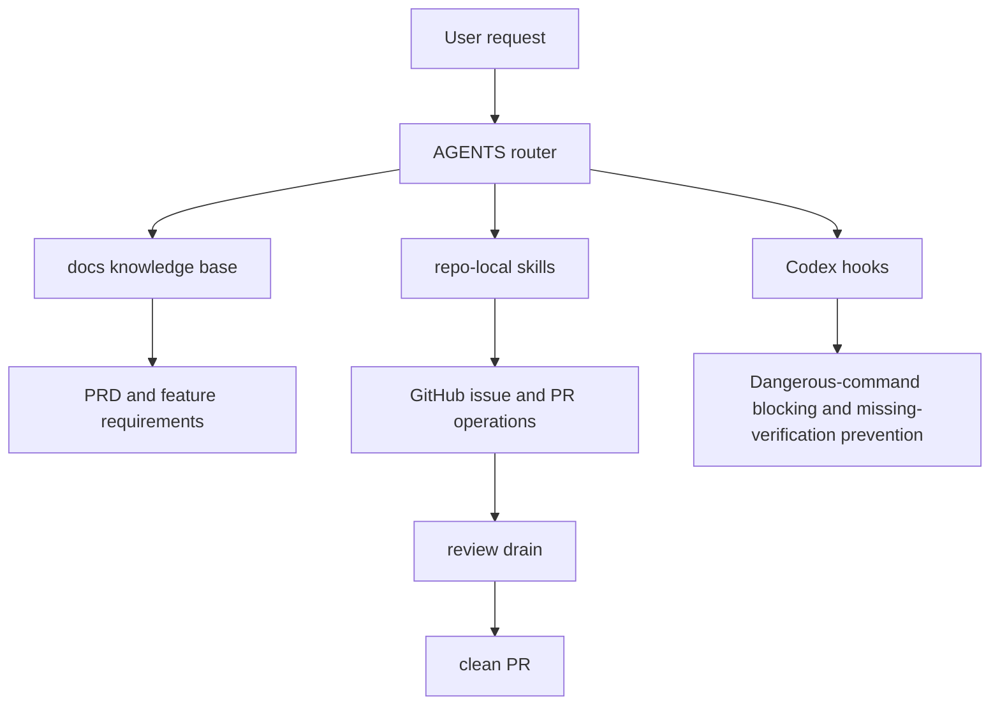

## Basic Operating Flow

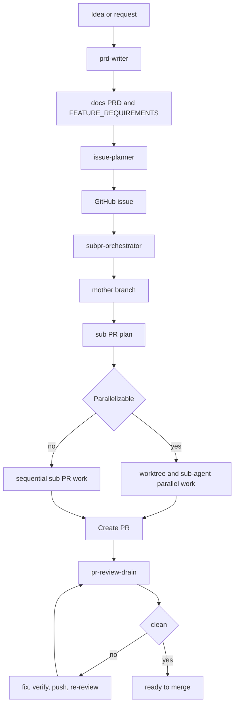

## Applying It To A New Project

1. Apply this boilerplate at the project root.
2. Add a project-language manifest only when needed.
3. Fill `README.md`, `ARCHITECTURE.md`, `docs/PRD.md`, and `docs/FEATURE_REQUIREMENTS.md` with project-specific content.
4. Run `./scripts/verify` to check document routing, hook settings, and GitHub operating files.
5. Connect the GitHub remote and default branch.
6. Enter requirements and start the operating flow from `prd-writer`.

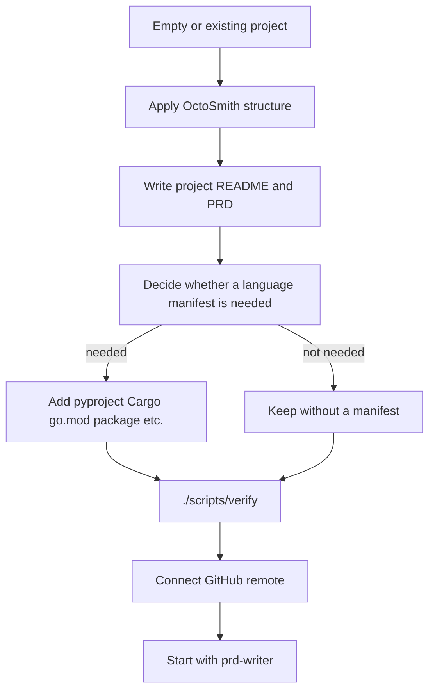

## Provided Skills

| Skill | Purpose |
| --- | --- |
| `project-bootstrap` | Applies docs, hooks, GitHub templates, and verification structure to a new project |
| `prd-writer` | Turns ideas into PRDs and feature requirements |
| `issue-planner` | Writes and creates GitHub issue drafts from PRD and development schedule criteria |
| `subpr-orchestrator` | Runs one issue as a mother branch and sub PR workflow |
| `pr-review-drain` | Processes PR review comments and threads until clean |

If repo-local skills are not exposed automatically in a Codex session, ask Codex to read the relevant `SKILL.md` path directly.

Example:

```text
Read .agents/skills/pr-review-drain/SKILL.md and apply it to the current PR.
```

## Skill Flows

### project-bootstrap

This skill installs the operating structure for a new project and leaves it in a verifiable state.

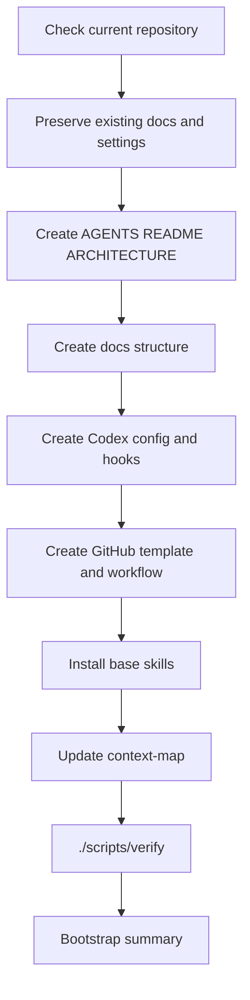

### prd-writer

This skill decomposes an idea into product-judgment criteria and implementable requirements.

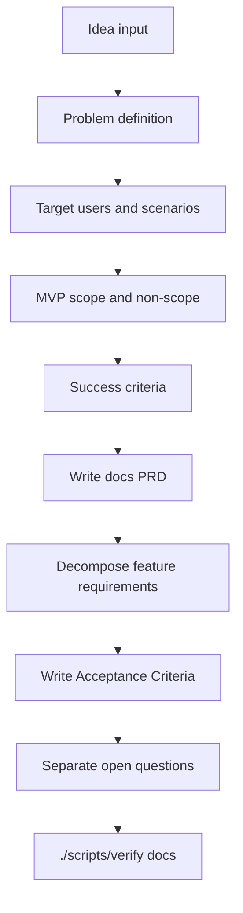

### issue-planner

This skill turns the PRD and feature requirements into a GitHub issue.

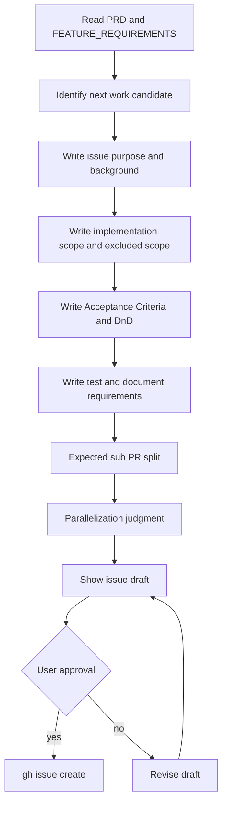

### subpr-orchestrator

This skill runs one issue as a mother branch and multiple sub PRs.

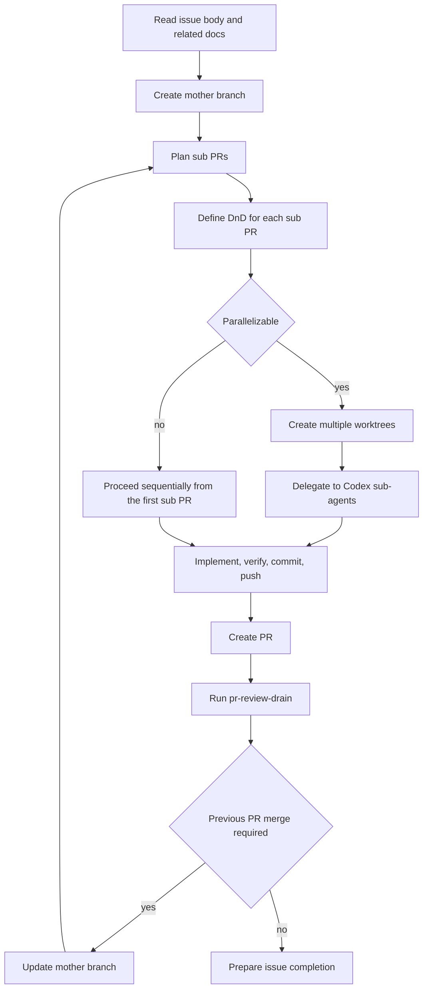

### pr-review-drain

This skill drains PR review feedback until the PR is clean.

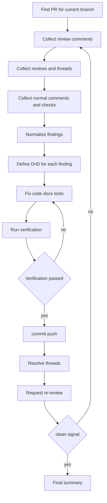

## Recommended Prompts

### Bootstrap A New Project

```text
$project-bootstrap
Apply the Codex-native operating boilerplate to this repository.
Create AGENTS.md, docs, .codex hooks, GitHub templates, verification scripts, and base skills, then make ./scripts/verify pass.
Infer the project name, default branch, and verification commands conservatively from the current repository state.
Write all summaries in Korean.
```

### Write A PRD

```text
$prd-writer
Write docs/PRD.md and docs/FEATURE_REQUIREMENTS.md based on the idea below.
Separate problem definition, target users, MVP scope, non-scope, success criteria, acceptance criteria, test requirements, and open questions.
Do not implement ambiguous items. Leave them as open questions.

Idea:
...
```

### Create An Issue

```text
$issue-planner
Based on the PRD and development plan documents, create a detailed GitHub issue for the next work item.
Include:
- Purpose
- Background
- Implementation scope
- Excluded scope
- Acceptance Criteria
- Definition of Done
- Test requirements
- Documentation update requirements
- Expected sub PR split
- Parallelization judgment

Show the draft before creating the issue, then create it with gh after approval.
```

### Run An Issue As Sub PRs

```text
/goal
Track GitHub issue #12 as the completion goal.

First read AGENTS.md and the docs router, then check the issue body and related PRD/FEATURE_REQUIREMENTS/PLANS documents.
In Plan mode, do not implement. Present a decision-complete proposed_plan.

After the plan is approved, update the current base branch, create the mother branch, and split the issue into sub PR units.
For each sub PR, document the goal, excluded scope, DnD, and verification command.

For parallelizable sub PRs, split the work with worktrees and Codex sub-agents. If there are sequential dependencies, merge the preceding PR, update the mother branch, then create the next branch.

For each PR, proceed through commit, push, and PR creation. At the end, repeat $pr-review-drain until the Codex review is clean.
Write all responses and work summaries in Korean.
```

### PR Review Drain

```text
$pr-review-drain
Run review drain on the PR for the current branch.
Collect all review comments and threads, define DnD for each finding, then repeat fix/verify/commit/push/resolve/re-review/polling until clean.
Include the PR URL, base/head, handled findings, verification commands, and remaining risks in the final summary.
```

## Examples

### From Product Idea To First Issue

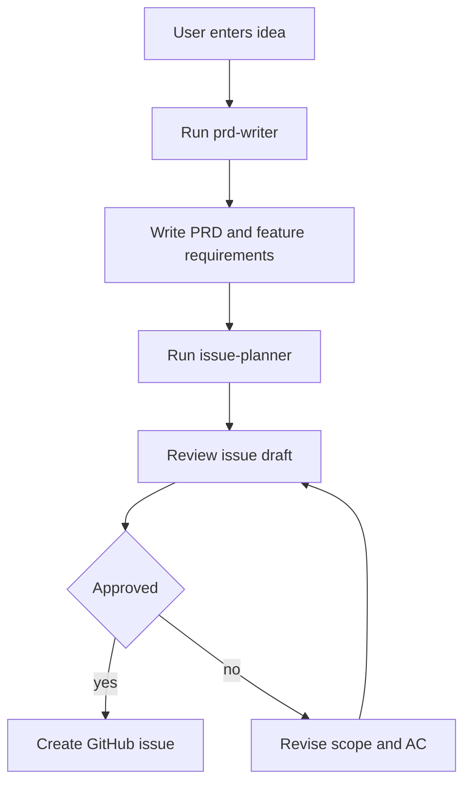

### Complete One Issue With Multiple PRs

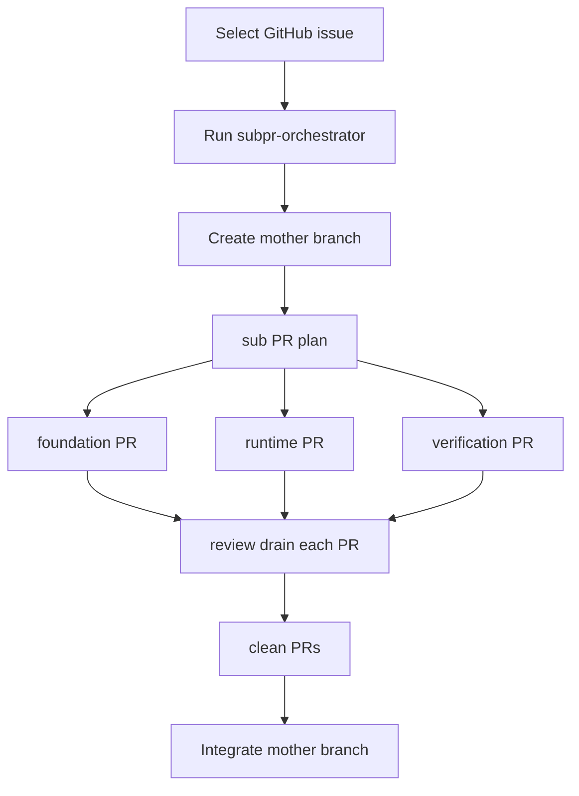

### Handle Review Comments

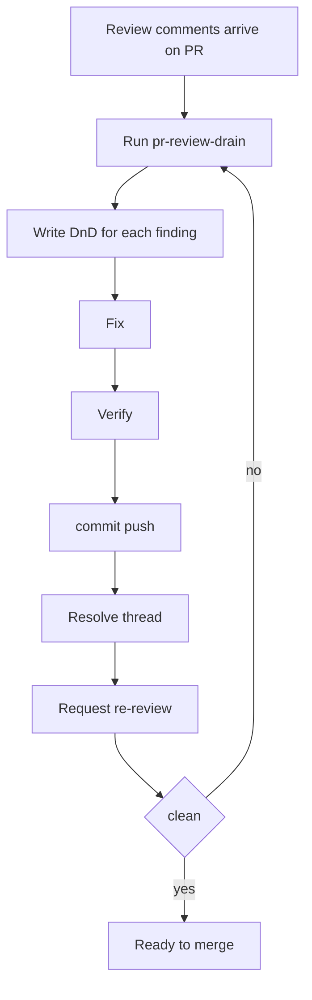

## GitHub Operating Rules

- Issues should follow the sections in `.github/ISSUE_TEMPLATE/feature.yml`.
- PR bodies should fill the DnD, verification, document changes, and risk sections in `.github/pull_request_template.md`.
- The default CI runs `./scripts/verify` in `.github/workflows/verify.yml`.
- Before requesting review, record the local `./scripts/verify` result in the PR body.
- Clean review means no unresolved threads, passing checks, a Codex clean signal, and a clean working tree.
- If you change GitHub templates or workflows, run `./scripts/verify github`.

## Hook Policy

Codex hooks do not replace the workflow. Hooks are guardrails, while skills own the workflow.

Hooks are responsible for:

- Blocking dangerous commands
- Preventing mutating Bash commands on `main`
- Warning or blocking access to secret files
- Requiring verification after document, hook, or lockfile changes
- Reminding the session about the document router on session start and prompt submit

Blocked examples:

```text
git reset --hard
git checkout --
git clean -fd
git push --force
rm -rf ...
cat .env
```

## Boundary Between Boilerplate And Server

This structure is intended for personal or small-team development-operations automation.

Good fits without a server:

- You want to repeat PRD writing and issue decomposition.
- You want to split large work into reviewable sub PRs.
- You want Codex to have stable pre-work documents and completion criteria.
- You want to process PR review comments systematically until clean.

Cases that need a separate orchestration server:

- GitHub webhooks must start jobs unattended.
- Multiple workers must hold leases and process a 24-hour queue.
- Failed Codex threads must be recovered automatically into new threads.
- You need operational requirements such as audit logs, retry policy, or SLA.
- The organization must share the same automation service.
