[한국어](./README.md) | [English](./README.en.md) | [日本語](./README.ja.md)

# OctoSmith

OctoSmith は、Codex、Git、GitHub を最大限に活用し、アイデアを PRD、issue、mother branch、必要に応じた sub PR、review-clean な PR へ鍛え上げる Codex-native な開発運用ボイラープレートです。

```text
OctoSmith
A Codex-native forge for GitHub issues, branches, and review-ready PRs.
```

## 前提条件

- Node.js 20 以上が必要です。
- Node はプロジェクト言語の制約ではありません。このボイラープレートの Codex hook と検証スクリプトを実行するためのランタイムです。
- このボイラープレートには `package.json` は含まれていません。
- 対象プロジェクトは Python、Go、Rust、Java、Swift、Ruby、PHP、JavaScript/TypeScript など、どの言語でも構いません。
- `package.json`、`pyproject.toml`、`Cargo.toml`、`go.mod` などの言語別 manifest は、実際のプロジェクトで必要になった時だけ追加します。

検証の入口は package manager ではなく shell script です。

```sh
./scripts/verify
```

個別の検証も可能です。

```sh
./scripts/verify docs
./scripts/verify hooks
./scripts/verify github
```

## 解決すること

Codex は単一タスクの実行には強い一方で、実際の開発運用では次の問題が繰り返し発生します。

- 要件が PRD、issue、PR 本文に散らばります。
- 大きな作業が 1 つの PR になり、レビューしにくくなります。
- 作業中断後、どの文書を読み、どこから再開すべきか不明確になります。
- review comment、unresolved thread、checks、Codex reaction の信号が手作業で漏れやすくなります。
- hook や文書ルールがないと、Codex の動きが毎回変わります。

OctoSmith はこの問題をサーバーではなく、文書、skill、hook、GitHub の表面で解決します。

## 全体構成

- [`AGENTS.md`](./AGENTS.md): Codex が作業前に読む文書を選ぶルートルーター
- [`ARCHITECTURE.md`](./ARCHITECTURE.md): ボイラープレートの運用境界と構造マップ
- [`docs/`](./docs/README.md): PRD、機能要件、設計、実行計画、信頼性、セキュリティ、品質基準
- [`.agents/skills/`](./.agents/skills/project-bootstrap/SKILL.md): 再利用可能な Codex 運用 workflow
- [`.codex/`](./.codex/config.toml): Codex 実行設定と hook
- [`.github/`](./.github/pull_request_template.md): GitHub issue/PR/Actions 運用の骨組み
- [`scripts/`](./scripts/verify): 文書、hook、GitHub 運用ファイルの検証入口

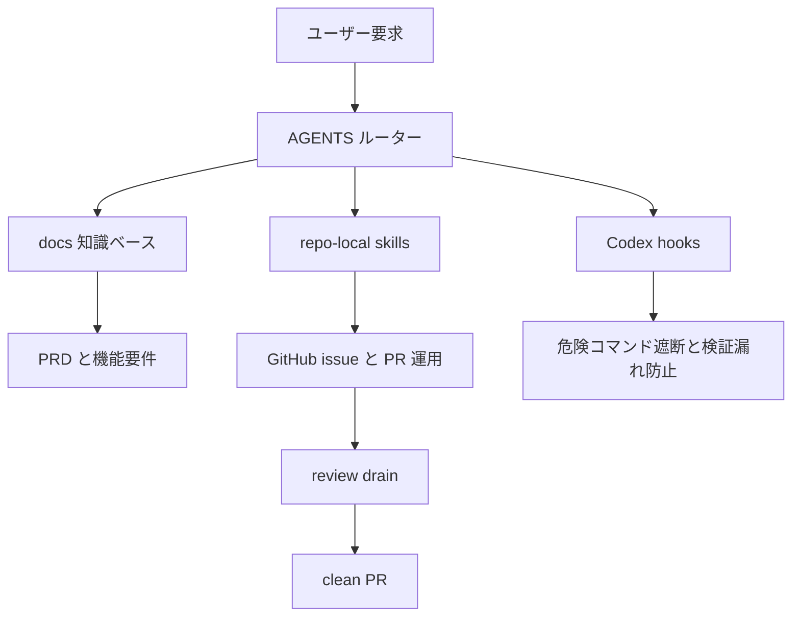

## 基本運用フロー

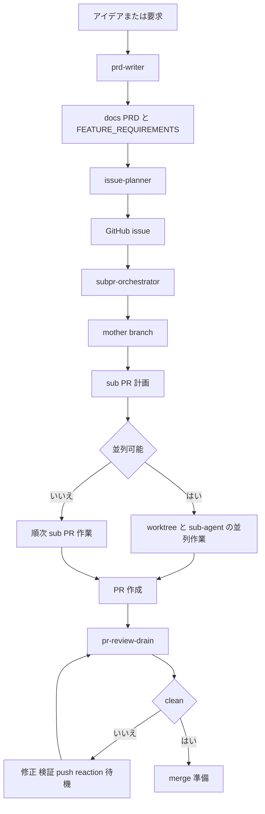

## 新しいプロジェクトへの適用手順

1. このボイラープレートをプロジェクトルートに適用します。
2. プロジェクト言語に合う manifest は、必要になった時だけ追加します。
3. `README.md`、`ARCHITECTURE.md`、`docs/PRD.md`、`docs/FEATURE_REQUIREMENTS.md` をプロジェクト内容で埋めます。
   - `README.en.md` と `README.ja.md` は OctoSmith リポジトリ用の配布文書です。対象プロジェクトで多言語 README が不要なら、削除するか `README.md` から言語リンクを外して構いません。
4. `./scripts/verify` で文書ルーティング、hook 設定、GitHub 運用ファイルを確認します。
5. GitHub remote と default branch を接続します。
6. 要件を入力し、`prd-writer` から運用フローを開始します。

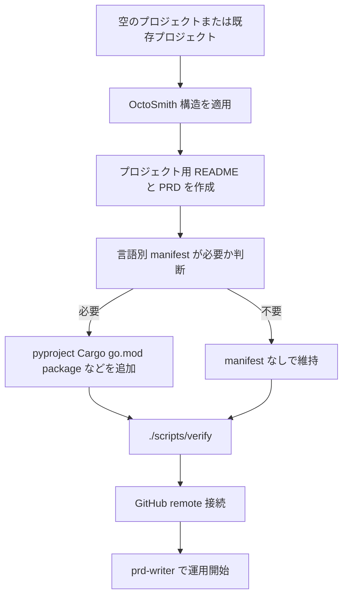

## 提供 skill

| Skill | 目的 |
| --- | --- |
| `project-bootstrap` | 新しいプロジェクトに文書、hook、GitHub テンプレート、検証構造を適用 |
| `prd-writer` | アイデアを PRD と機能要件へ整理 |
| `issue-planner` | PRD と開発計画を基準に GitHub issue のドラフト作成と生成を行う |
| `subpr-orchestrator` | 1 つの issue を mother branch で運用し、変更量が大きい時だけ sub PR workflow に分割 |
| `pr-review-drain` | PR review comment と thread を clean 状態まで処理 |

Codex セッションで repo-local skill が自動表示されない場合は、該当する `SKILL.md` パスを直接読ませます。

例:

```text
.agents/skills/pr-review-drain/SKILL.md を読み、現在の PR に適用して。
```

## skill フロー

### project-bootstrap

新しいプロジェクトに運用構造を導入し、検証可能な状態にする skill です。

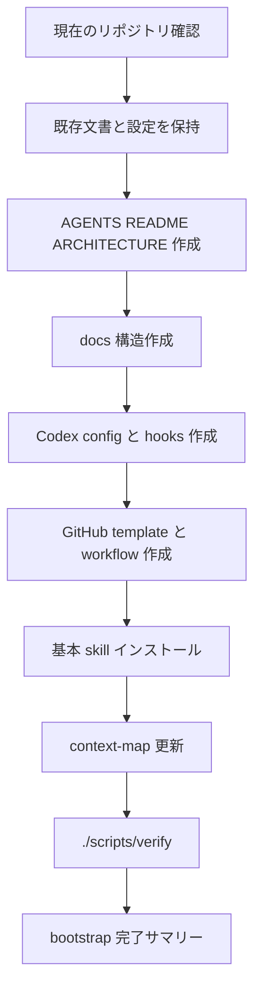

### prd-writer

アイデアを製品判断基準と実装可能な要件へ分解する skill です。

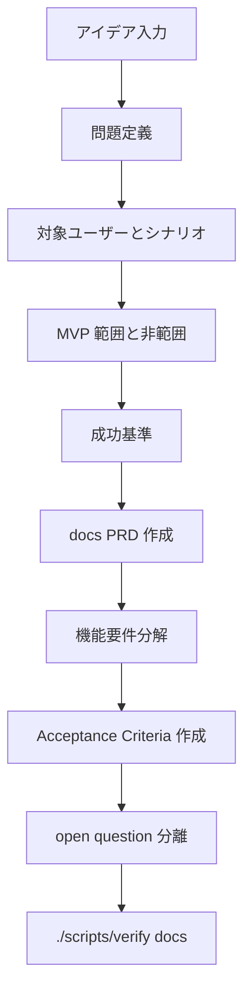

### issue-planner

PRD と機能要件を GitHub issue に変換する skill です。

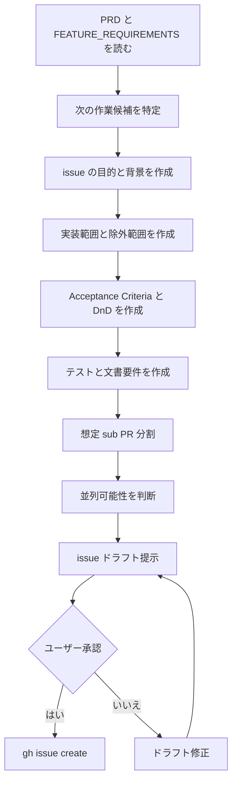

### subpr-orchestrator

1 つの issue を mother branch で運用し、変更量が大きくレビューしにくい時だけ複数の sub PR に分ける skill です。

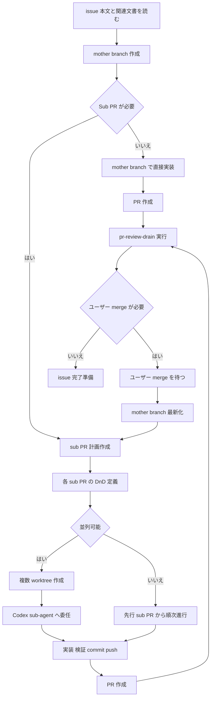

### pr-review-drain

PR のレビュー feedback と Codex reaction を merge 可能状態まで処理する skill です。

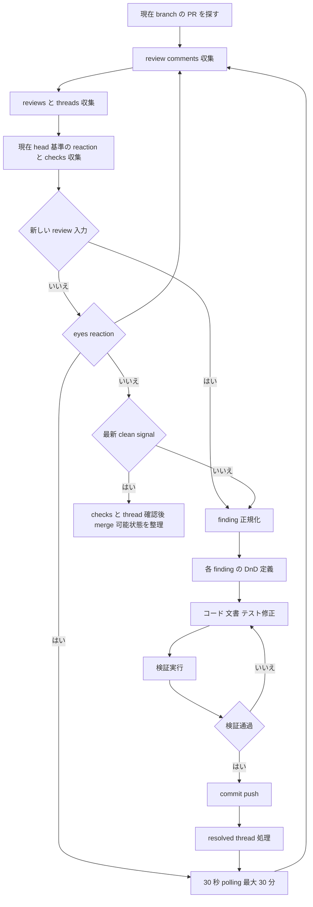

## 推奨プロンプト

### 新しいプロジェクトの bootstrap

```text
$project-bootstrap
このリポジトリに Codex-native 運用ボイラープレートを適用して。
AGENTS.md、docs、.codex hooks、GitHub テンプレート、検証スクリプト、基本 skill を作成し、./scripts/verify まで通して。
プロジェクト名、default branch、検証コマンドは現在のリポジトリ状態から保守的に推論して。
すべてのサマリーは韓国語で書いて。
```

### PRD 作成

```text
$prd-writer
下のアイデアを基準に docs/PRD.md と docs/FEATURE_REQUIREMENTS.md を作成して。
問題定義、対象ユーザー、MVP 範囲、非範囲、成功基準、acceptance criteria、テスト要件、open question を分離して。
曖昧な項目は実装せず、open question として残して。

アイデア:
...
```

### issue 作成

```text
$issue-planner
PRD と開発計画文書を基準に、次に行うべき GitHub issue を詳しく作成して。
含めること:
- 目的
- 背景
- 実装範囲
- 除外範囲
- Acceptance Criteria
- Definition of Done
- テスト要件
- 文書更新要件
- 想定 sub PR 分割
- 並列可能性の判断

issue を作る前にドラフトを先に見せ、承認後に gh で作成して。
```

### issue を mother branch で運用し必要時だけ sub PR に分割

```text
/goal
GitHub issue #12 を完了目標として追跡して。

まず AGENTS.md と docs ルーターを読み、issue 本文と関連する PRD/FEATURE_REQUIREMENTS/PLANS 文書を確認して。
Plan 段階では実装せず、decision-complete な proposed_plan を提示して。

Plan が承認されたら現在の base branch を最新化し、mother branch を作った後、単一 PR で十分か先に判断して。
単一 PR で十分なら sub PR なしで mother branch で直接作業し、変更量が大きくレビューしにくい場合だけ sub PR 単位に分けて。
sub PR に分ける場合は、各 sub PR ごとに目標、除外範囲、DnD、検証コマンドを文書化して。

並列可能な sub PR は worktree と Codex sub-agent に分けて進め、順次依存があればユーザーが先行 PR を merge したと確認してから最新化し、次の branch を作って。
Codex は merge を直接実行せず、必要な merge はユーザーに返して。

各 PR は commit/push/create PR まで進め、最後に $pr-review-drain で Codex review が clean になるまで繰り返して。
すべての回答と作業サマリーは韓国語で書いて。
```

### PR review drain

```text
$pr-review-drain
現在ブランチの PR を対象に review drain を実行して。
現在 head 基準で PR 本文 reaction、review comment、thread、checks をすべて収集し、新しい review 入力がなく eyes reaction だけがあれば 30 秒ごとに最大 30 分まで待機して。
レビューが付いたら eyes が残っていても各 finding ごとに DnD を定義し、修正/検証/コミット/push/resolve を繰り返して。
現在 head 以降の +1 reaction または no-major-issues 相当の Codex レビュー/コメントが確認でき、checks/thread が clean なら merge 可能状態として整理して。
最終サマリーには PR URL、base/head、処理した finding、検証コマンド、最後の reaction、clean signal の最新性根拠、polling 待機時間、skipped/neutral check、resolve 失敗有無、残りリスクを含めて。
```

## 使用例

### 製品アイデアから最初の issue まで

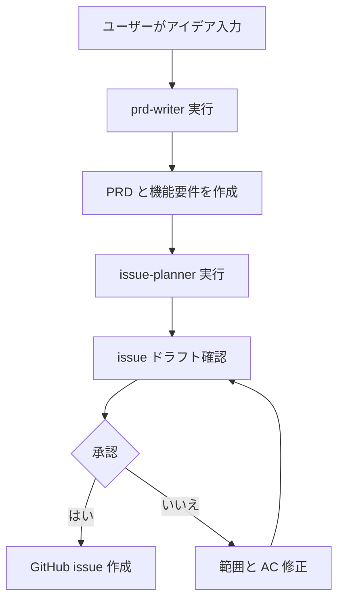

### 1 つの issue を複数 PR で完了

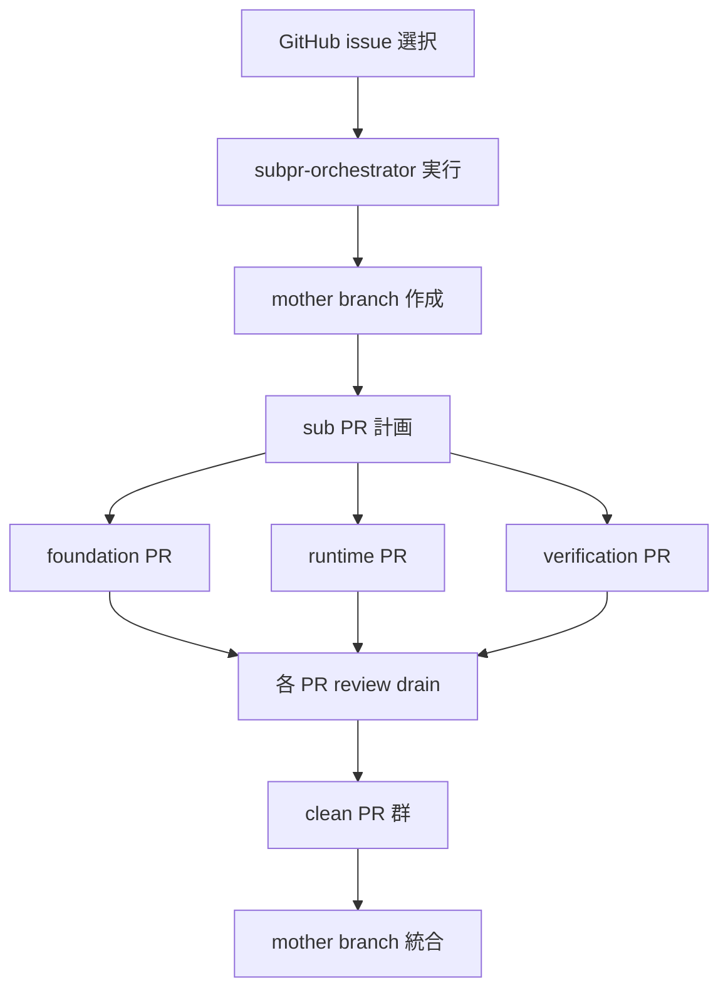

### レビューコメント処理

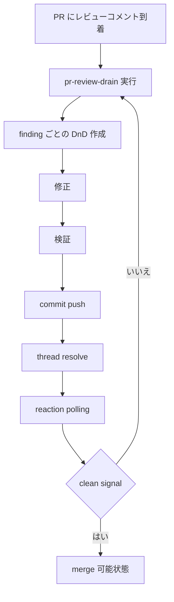

## GitHub 運用ルール

- issue は `.github/ISSUE_TEMPLATE/feature.yml` のセクションを基準に作成します。
- PR 本文は `.github/pull_request_template.md` の DnD、検証、文書変更、リスクセクションを埋めます。
- 基本 CI は `.github/workflows/verify.yml` で `./scripts/verify` を実行します。
- レビュー依頼前に、ローカル `./scripts/verify` の結果を PR 本文へ残します。
- review clean 条件は unresolved thread なし、failed/pending checks なし、現在 head 基準の Codex `+1` reaction または no-major-issues レビュー/コメント clean signal、作業 tree clean です。
- GitHub テンプレートや workflow を変更したら `./scripts/verify github` を実行します。

## hook ポリシー

Codex hook は workflow を代替しません。hook は安全装置であり、workflow は skill が担当します。

hook が担当すること:

- 危険コマンドの遮断
- `main` での mutating Bash コマンド防止
- secret ファイルアクセスの警告/遮断
- 文書、hook、lockfile 変更後の検証要求
- セッション開始時とプロンプト送信時の文書ルーターリマインド

遮断例:

```text
git reset --hard
git checkout --
git clean -fd
git push --force
rm -rf ...
cat .env
```

## ボイラープレートとサーバーの境界

この構造は個人または小規模チームの開発運用自動化に向いています。

サーバーなしで扱いやすい場合:

- PRD 作成と issue 分解を繰り返したい。
- 大きな作業を sub PR に分け、レビュー可能にしたい。
- Codex が作業前に読む文書と完了基準を安定して固定したい。
- PR レビューコメントを clean 状態まで体系的に処理したい。

別のオーケストレーションサーバーが必要な場合:

- GitHub webhook を受けて無人で job を開始する必要がある。
- 複数 worker が lease を取り、24 時間 queue を処理する必要がある。
- 失敗した Codex thread を自動的に新しい thread として復旧する必要がある。
- audit log、retry policy、SLA のような運用要件がある。
- 組織単位で同じ自動化サービスを共有する必要がある。
