[한국어](./README.md) | [English](./README.en.md) | [日本語](./README.ja.md)

# OctoSmith

OctoSmith는 Codex, Git, GitHub를 최대한 활용해 아이디어를 PRD, issue, mother/sub PR, review-clean PR로 벼려내는 Codex-native 개발 운영 보일러플레이트입니다.

```text
OctoSmith
A Codex-native forge for GitHub issues, branches, and review-ready PRs.
```

## 전제 조건

- Node.js 20 이상이 필요합니다.
- Node는 프로젝트 언어 제약이 아니라, 보일러플레이트의 Codex hook과 검증 스크립트를 실행하기 위한 런타임입니다.
- 이 보일러플레이트는 `package.json`을 포함하지 않습니다.
- 대상 프로젝트는 Python, Go, Rust, Java, Swift, Ruby, PHP, JavaScript/TypeScript 등 어떤 언어여도 됩니다.
- 언어별 manifest인 `package.json`, `pyproject.toml`, `Cargo.toml`, `go.mod` 등은 실제 프로젝트가 필요할 때만 추가합니다.

검증 진입점은 package manager가 아니라 shell script입니다.

```sh
./scripts/verify
```

개별 검증도 가능합니다.

```sh
./scripts/verify docs
./scripts/verify hooks
./scripts/verify github
```

## 무엇을 해결하나

Codex는 단일 작업 수행에는 강하지만, 실제 개발 운영에서는 다음 문제가 반복됩니다.

- 요구사항이 PRD, issue, PR 본문에 흩어집니다.
- 큰 작업이 하나의 PR로 올라와 리뷰하기 어렵습니다.
- 작업 중단 후 어떤 문서를 읽고 어디서 이어야 하는지 불명확합니다.
- review comment, unresolved thread, checks, 재리뷰 요청이 수동으로 누락됩니다.
- hook이나 문서 규칙 없이 Codex가 매번 다른 순서로 움직입니다.

OctoSmith는 이 문제를 서버가 아니라 문서, skill, hook, GitHub 표면으로 해결합니다.

## 전체 구조

- [`AGENTS.md`](./AGENTS.md): Codex가 작업 전에 읽을 문서를 고르는 루트 라우터
- [`ARCHITECTURE.md`](./ARCHITECTURE.md): 보일러플레이트의 운영 경계와 구조 지도
- [`docs/`](./docs/README.md): PRD, 기능 요구사항, 설계, 실행 계획, 신뢰성, 보안, 품질 기준
- [`.agents/skills/`](./.agents/skills/project-bootstrap/SKILL.md): 반복 가능한 Codex 운영 workflow
- [`.codex/`](./.codex/config.toml): Codex 실행 설정과 hook
- [`.github/`](./.github/pull_request_template.md): GitHub issue/PR/Actions 운영 골격
- [`scripts/`](./scripts/verify): 문서, hook, GitHub 운영 파일 검증 진입점

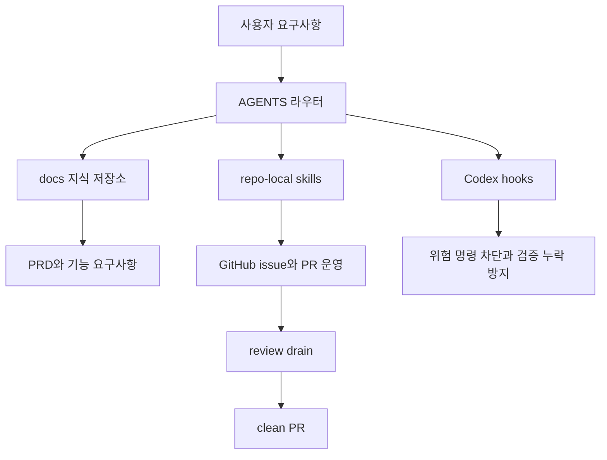

## 기본 운영 흐름

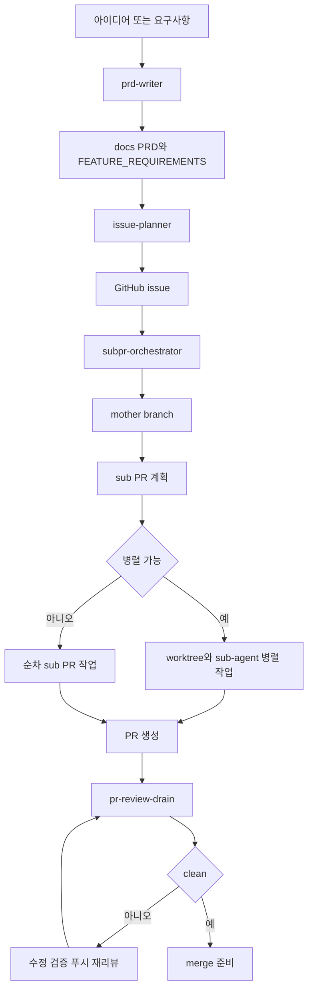

## 새 프로젝트 적용 순서

1. 이 보일러플레이트를 프로젝트 루트에 적용합니다.
2. 프로젝트 언어에 맞는 manifest는 필요할 때만 추가합니다.
3. `README.md`, `ARCHITECTURE.md`, `docs/PRD.md`, `docs/FEATURE_REQUIREMENTS.md`를 프로젝트 내용으로 채웁니다.
   - `README.en.md`, `README.ja.md`는 OctoSmith 저장소용 배포 문서입니다. 대상 프로젝트에서 다국어 README가 필요 없으면 삭제하거나 `README.md`에서 언어 링크를 제거해도 됩니다.
4. `./scripts/verify`로 문서 라우팅, hook 설정, GitHub 운영 파일을 확인합니다.
5. GitHub remote와 기본 branch를 연결합니다.
6. 요구사항을 입력해 `prd-writer`부터 운영 흐름을 시작합니다.

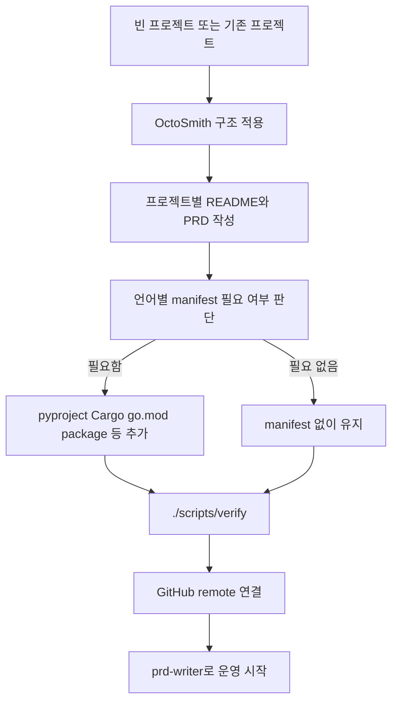

## 제공 skill

| Skill | 목적 |
| --- | --- |
| `project-bootstrap` | 새 프로젝트에 문서, hook, GitHub 템플릿, 검증 구조를 적용 |
| `prd-writer` | 아이디어를 PRD와 기능 요구사항으로 정리 |
| `issue-planner` | PRD와 개발 일정 기준으로 GitHub issue 초안 작성 및 생성 |
| `subpr-orchestrator` | issue 하나를 mother branch와 sub PR workflow로 운영 |
| `pr-review-drain` | PR 리뷰 댓글과 thread를 clean 상태까지 처리 |

Codex 세션에서 repo-local skill이 자동 노출되지 않으면, 프롬프트에 해당 `SKILL.md` 경로를 직접 지정해 읽게 합니다.

예:

```text
.agents/skills/pr-review-drain/SKILL.md를 읽고 현재 PR에 적용해줘.
```

## skill 흐름

### project-bootstrap

새 프로젝트에 운영 구조를 설치하고 검증 가능한 상태로 만드는 skill입니다.

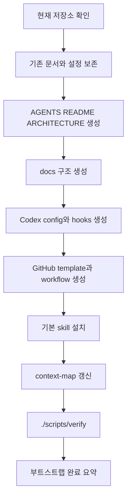

### prd-writer

아이디어를 제품 판단 기준과 구현 가능한 요구사항으로 분해하는 skill입니다.

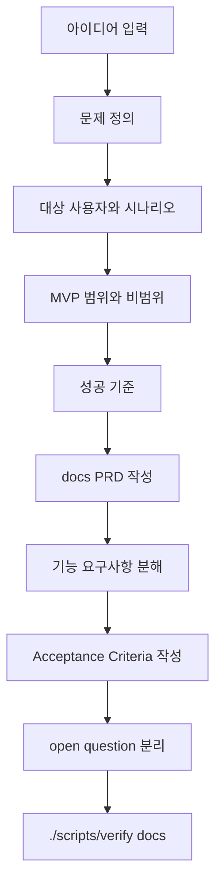

### issue-planner

PRD와 기능 요구사항을 GitHub issue로 바꾸는 skill입니다.

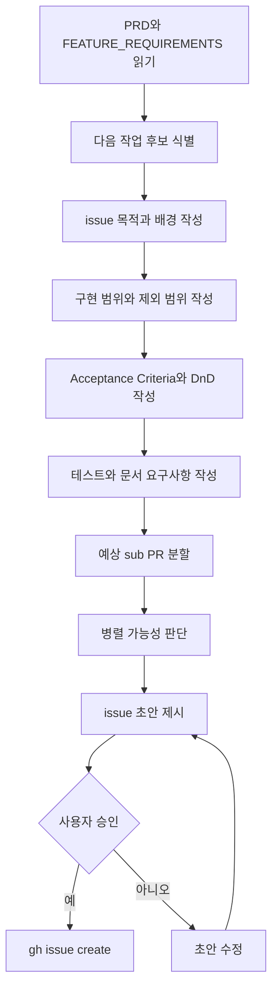

### subpr-orchestrator

issue 하나를 mother branch와 여러 sub PR로 운영하는 skill입니다.

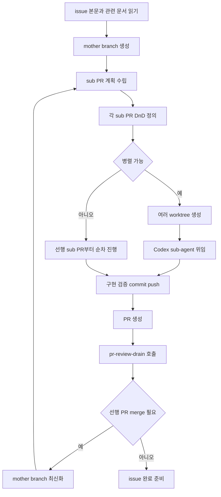

### pr-review-drain

PR의 리뷰 피드백을 clean 상태까지 닫는 skill입니다.

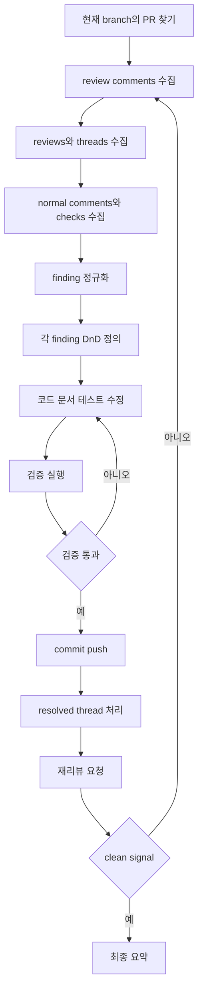

## 권장 프롬프트

### 새 프로젝트 부트스트랩

```text
$project-bootstrap
이 저장소에 Codex-native 운영 보일러플레이트를 적용해줘.
AGENTS.md, docs, .codex hooks, .github 템플릿, 검증 스크립트, 기본 skill을 만들고 ./scripts/verify까지 통과시켜줘.
프로젝트명과 기본 branch, 검증 명령은 현재 저장소 상태에서 보수적으로 추론해줘.
모든 요약은 한국어로 작성해줘.
```

### PRD 작성

```text
$prd-writer
아래 아이디어를 기준으로 docs/PRD.md와 docs/FEATURE_REQUIREMENTS.md를 작성해줘.
문제 정의, 대상 사용자, MVP 범위, 비범위, 성공 기준, acceptance criteria, 테스트 요구사항, open question을 분리해줘.
모호한 부분은 구현하지 말고 open question으로 남겨줘.

아이디어:
...
```

### issue 생성

```text
$issue-planner
PRD와 개발 일정 문서를 기준으로 다음에 해야 할 GitHub issue를 자세히 만들어줘.
포함할 것:
- 목적
- 배경
- 구현 범위
- 제외 범위
- Acceptance Criteria
- Definition of Done
- 테스트 요구사항
- 문서 갱신 요구사항
- 예상 sub PR 분할
- 병렬 가능성 판단

issue를 만들기 전에 초안을 먼저 보여주고, 승인 후 gh로 생성해줘.
```

### issue를 sub PR로 운영

```text
/goal
GitHub issue #12를 완료 목표로 추적해줘.

먼저 AGENTS.md와 docs 라우터를 읽고, issue 본문과 관련 PRD/FEATURE_REQUIREMENTS/PLANS 문서를 확인해줘.
Plan 단계에서는 구현하지 말고 decision-complete한 proposed_plan을 제시해줘.

Plan이 승인되면 현재 base branch를 최신화하고 mother branch를 만든 뒤, issue를 sub PR 단위로 나눠줘.
각 sub PR마다 목표, 제외 범위, DnD, 검증 명령을 문서화해줘.

병렬 가능한 sub PR은 worktree와 Codex sub-agent로 나눠 진행하고, 순차 의존성이 있으면 선행 PR merge 후 최신화한 뒤 다음 branch를 만들어줘.

각 PR은 commit/push/create PR까지 진행하고, 마지막에 $pr-review-drain으로 Codex 리뷰가 clean 될 때까지 반복해줘.
모든 답변과 작업 요약은 한국어로 작성해줘.
```

### PR 리뷰 drain

```text
$pr-review-drain
현재 브랜치의 PR을 대상으로 리뷰 drain을 수행해줘.
리뷰 comment와 thread를 모두 수집하고, 각 finding별 DnD를 정의한 뒤 수정/검증/커밋/푸시/resolve/re-review/polling을 clean 상태까지 반복해줘.
최종 요약에는 PR URL, base/head, 처리한 finding, 검증 명령, 남은 리스크를 포함해줘.
```

## 사용 예시

### 제품 아이디어에서 첫 issue까지

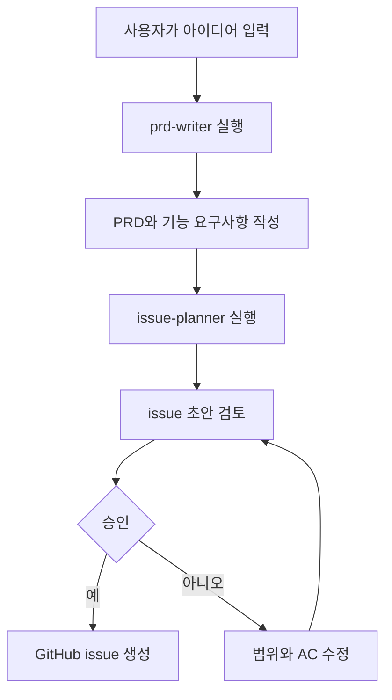

### issue 하나를 여러 PR로 완료

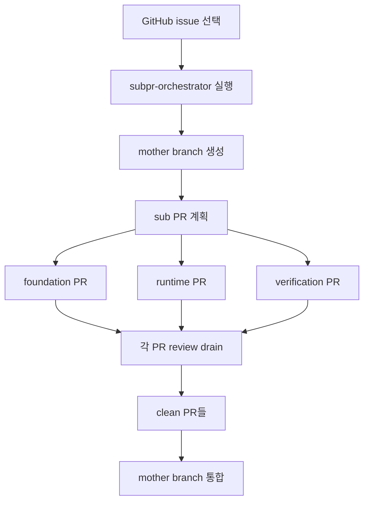

### 리뷰 댓글 처리

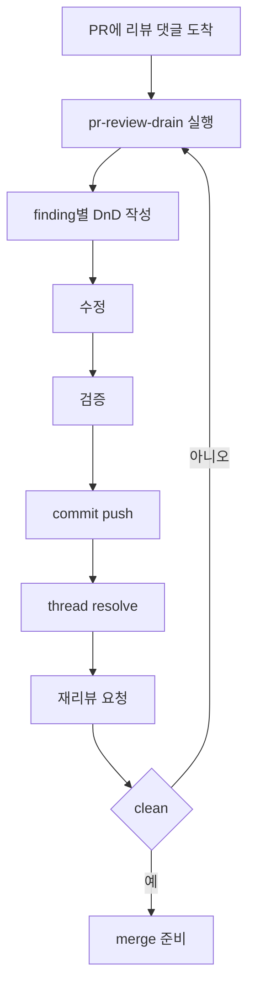

## GitHub 운영 규칙

- issue는 `.github/ISSUE_TEMPLATE/feature.yml`의 섹션을 기준으로 작성합니다.
- PR 본문은 `.github/pull_request_template.md`의 DnD, 검증, 문서 변경, 리스크 섹션을 채웁니다.
- 기본 CI는 `.github/workflows/verify.yml`에서 `./scripts/verify`를 실행합니다.
- 리뷰 요청 전에는 로컬 `./scripts/verify` 결과를 PR 본문에 남깁니다.
- 리뷰 clean 조건은 unresolved thread 없음, checks pass, Codex clean signal, 작업 tree clean입니다.
- GitHub 템플릿이나 workflow를 바꾸면 `./scripts/verify github`를 실행합니다.

## hook 정책

Codex hook은 workflow를 대신하지 않습니다. hook은 안전 장치이고, workflow는 skill이 담당합니다.

hook이 맡는 역할:

- 위험 명령 차단
- `main`에서 mutating Bash 명령 방지
- secret 파일 접근 경고/차단
- 문서, hook, lockfile 변경 후 검증 요구
- 세션 시작과 프롬프트 제출 시 문서 라우터 리마인드

차단 예:

```text
git reset --hard
git checkout --
git clean -fd
git push --force
rm -rf ...
cat .env
```

## 보일러플레이트와 서버의 경계

이 구조는 개인 또는 소규모 팀의 개발 운영 자동화에 맞춥니다.

서버 없이 처리하기 좋은 경우:

- PRD 작성과 issue 분해를 반복하고 싶다.
- 큰 작업을 sub PR로 나눠 리뷰 가능하게 만들고 싶다.
- Codex가 작업 전에 읽을 문서와 완료 기준을 안정적으로 고정하고 싶다.
- PR 리뷰 댓글을 clean 상태까지 체계적으로 처리하고 싶다.

별도 오케스트레이션 서버가 필요한 경우:

- GitHub webhook을 받아 무인으로 job을 시작해야 한다.
- 여러 worker가 lease를 잡고 24시간 queue를 처리해야 한다.
- 실패한 Codex thread를 자동으로 새 thread로 복구해야 한다.
- audit log, retry policy, SLA 같은 운영 요구가 있다.
- 조직 단위로 같은 자동화 서비스를 공유해야 한다.
